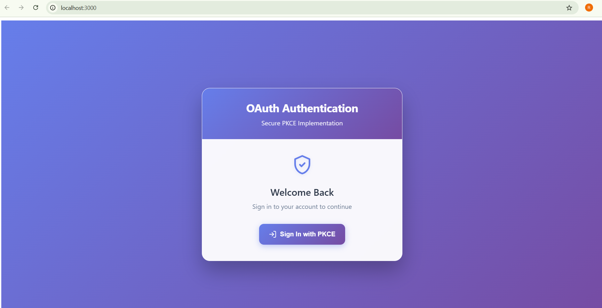
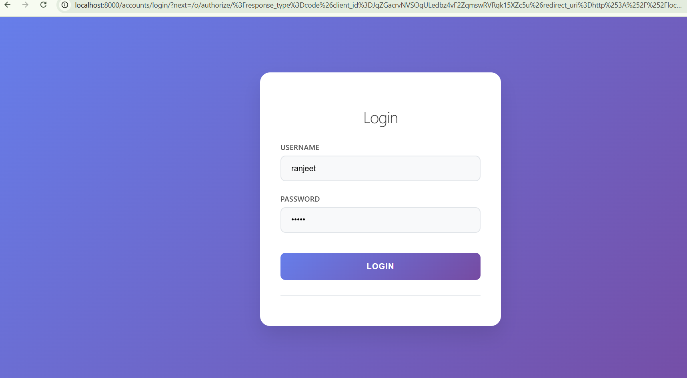
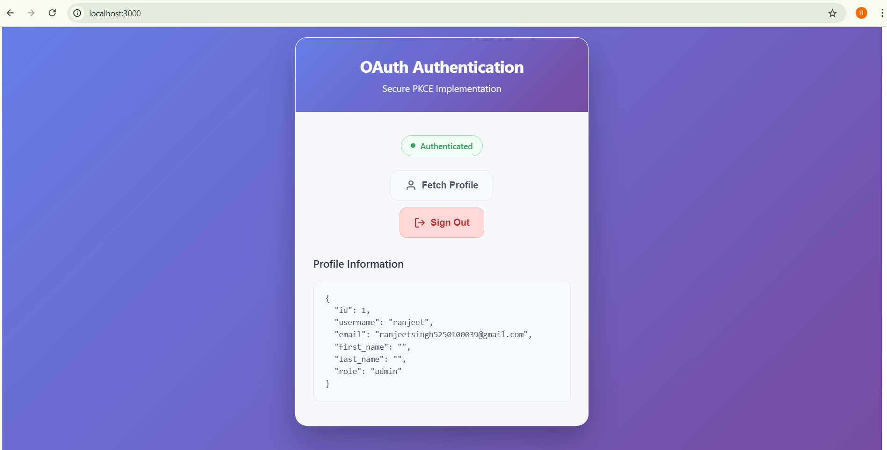
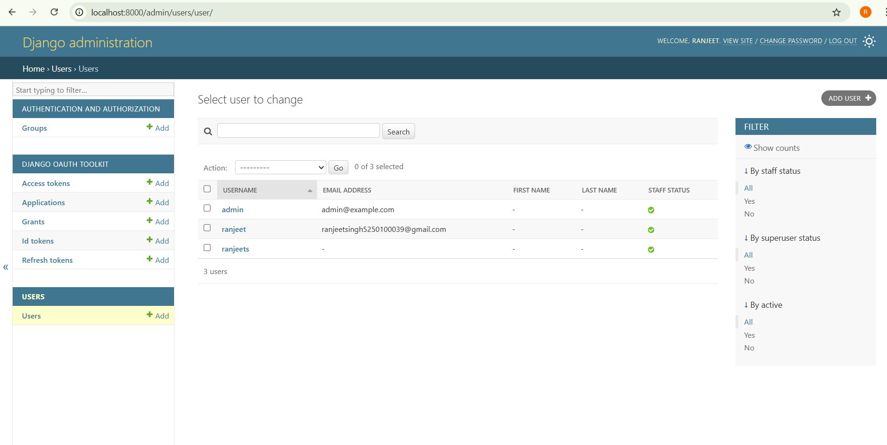
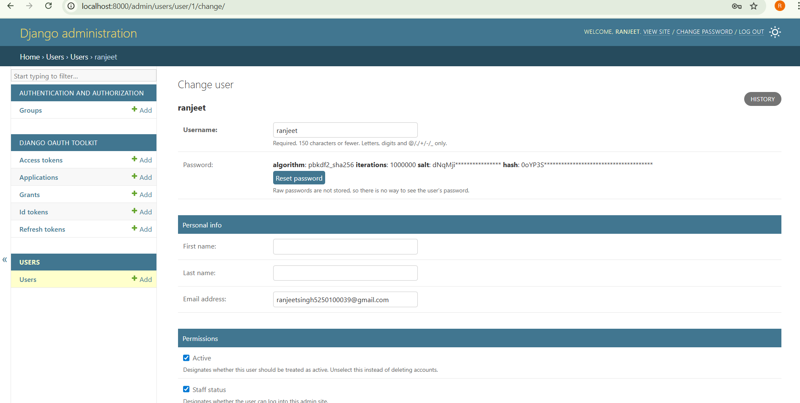
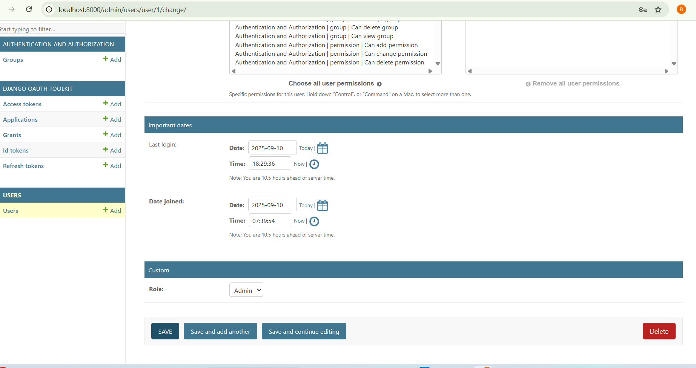
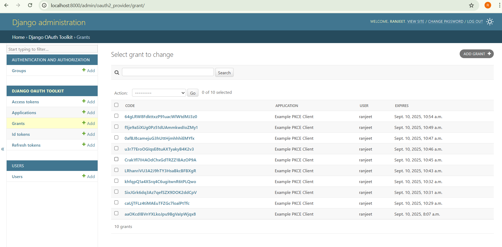

# OAuth2 Project (Django Authorization Server + React PKCE Client)

This repository contains a working example implementing OAuth2 Authorization Code + PKCE using Django OAuth Toolkit, a React PKCE client, and optional Docker setup.

## What's included
- Django OAuth Toolkit (authorization server)
- Authorization Code (PKCE) + Refresh Token flow
- Token rotation + configurable expiry
- Custom User model with role field
- APIs: token issuance (DOT), token introspection, validate-token, userinfo, logout (revokes tokens), roles
- React PKCE client (login, callback, token exchange, profile)
- Docker & docker-compose for Postgres + web

## Prerequisites
- Node.js (for React) & npm
- Python 3.10+
- PostgreSQL (for local DB)

## Local (no Docker) quick setup
1. Create virtualenv and install dependencies:
 ```bash
python -m venv .venv
# Windows
.\.venv\Scripts\activate
# macOS/Linux
source .venv/bin/activate
pip install -r requirements.txt
```
2. Setup database (sqlite default will work, or use Postgres):
   - By default settings use sqlite for quick local dev.
   - For Postgres, create DB and set DB_* env vars.
   ```env
   DB_HOST=db
   # OAuth Client (generated via create_oauth_app)
   OAUTH_CLIENT_ID=

   # React App URLs
   OAUTH_REDIRECT_URI=http://localhost:3000/callback
   OAUTH_AUTH_URL=http://localhost:8000/o/authorize/
   OAUTH_TOKEN_URL=http://localhost:8000/o/token/
   API_USERINFO_URL=http://localhost:8000/api/userinfo/

   # SECURITY
   SECRET_KEY=
   DEBUG=True
   ALLOWED_HOSTS=localhost,127.0.0.1

   # DATABASE (local Postgres example)
   DB_NAME=oauth_db
   DB_USER=
   DB_PASSWORD=
   DB_HOST=localhost
   DB_PORT=5432

   # OAUTH2 SETTINGS
   ACCESS_TOKEN_EXPIRE_SECONDS=3600         # 1 hour
   REFRESH_TOKEN_EXPIRE_SECONDS=1209600     # 14 days
   ROTATE_REFRESH_TOKEN=True

   # DJANGO SUPERUSER (optional auto-create)
   DJANGO_SUPERUSER_USERNAME=admin
   DJANGO_SUPERUSER_EMAIL=admin@example.com
   DJANGO_SUPERUSER_PASSWORD=admin123

   # CORS (for React dev)
   CORS_ALLOWED_ORIGINS=http://localhost:3000

   ```
3. Run migrations:
   ```bash
   python manage.py makemigrations
   python manage.py migrate
   ```
4. Create superuser and seed demo users:
   ```bash
   python manage.py createsuperuser
   python manage.py seed_demo_users
   ```
5. Create OAuth app (PKCE public client):
   ```bash
   python manage.py create_oauth_app
   ```
   Note the printed Client ID and put it into react-client/src/config.js
6. Run server:
   ```bash
   python manage.py runserver
   ```
7. React client:
   ```bash
   cd react-client
   npm install
   # open react-client/src/config.js and set OAUTH_CLIENT_ID
   npm start
   ```
8. Test: open http://localhost:3000 -> Login -> Authorize -> Fetch Profile

## Docker setup
1. Copy .env.example to .env and adjust values (for docker DB_HOST should be 'db')
2. Start:
   ```bash
   docker-compose up --build -d
   ```
3. Run migrations and create oauth app:
   ```bash
   docker-compose exec web python manage.py migrate
   docker-compose exec web python manage.py createsuperuser
   docker-compose exec web python manage.py seed_demo_users
   docker-compose exec web python manage.py create_oauth_app
   ```

---

## Manual token testing (curl)
- Exchange code for token (server-side example):
  ```bash
  curl -X POST http://localhost:8000/o/token/     -d "grant_type=authorization_code&code=<CODE>&redirect_uri=http://localhost:3000/callback&client_id=<CLIENT_ID>&client_secret=<CLIENT_SECRET>"
  ```

- Refresh token:
  ```bash
  curl -X POST http://localhost:8000/o/token/     -d "grant_type=refresh_token&refresh_token=<REFRESH_TOKEN>&client_id=<CLIENT_ID>&client_secret=<CLIENT_SECRET>"
  ```

- Introspect token:
  ```bash
  curl -u "<CLIENT_ID>:<CLIENT_SECRET>" -X POST http://localhost:8000/o/introspect/ -d "token=<ACCESS_TOKEN>"
  ```

- Validate token (custom endpoint):
  ```bash
  curl -X POST http://localhost:8000/api/validate-token/ -H "Content-Type: application/json" -d '{"token":"<ACCESS_TOKEN>"}'
  ```

- Logout (revokes tokens for current user):
  ```bash
  curl -X POST http://localhost:8000/api/logout/ -H "Authorization: Bearer <ACCESS_TOKEN>"
  ```

- Roles endpoint (admin only):
  ```bash
  curl -X GET http://localhost:8000/api/roles/ -H "Authorization: Bearer <ADMIN_ACCESS_TOKEN>"
  ```
---

## Security & production checklist
- Set `DEBUG=False` in `.env`
- Use a secure `SECRET_KEY`
- Use HTTPS and set `SESSION_COOKIE_SECURE=True`, `CSRF_COOKIE_SECURE=True`, `SESSION_COOKIE_HTTPONLY=True`
- Ensure `ALLOWED_HOSTS` includes your host
- Rotate client secrets periodically
- Use PKCE for public clients (SPA/mobile)
- Store tokens securely: prefer httpOnly secure cookies or server-side sessions over localStorage for sensitive apps
- Rate limit token endpoints and monitor logs for suspicious activity

---

## Files added/modified for this assignment
- `auth_server/settings.py` -> DOT and security settings
- `users/` -> custom user model, serializers, views (userinfo/logout/roles/validate-token)
- `users/management/commands/create_oauth_app.py` -> create sample OAuth application
- `client_backend/` -> exchange_code endpoint for secure server-side code exchange
- `react-client/` -> PKCE client with code exchange and profile fetch
- `docker-compose.yml` -> includes Postgres and web services
- `.env.example`, `README.md`

---

## Troubleshooting
- If containers fail to start, check logs:
  ```bash
  docker-compose logs web
  docker-compose logs db
  ```
- If migrations fail, ensure DB env vars in `.env` match `docker-compose`.
- If React cannot reach backend due to CORS, either run React on same machine and allow CORS or set up proxy in `package.json` for development.

---

If you want, I can also:
- Add CORS settings to `auth_server/settings.py` (django-cors-headers) for easier dev,
- Add a management command to seed demo users,
- Provide a docker-compose override for local development.


## Notes
- For SPAs use PKCE. For confidential clients use server-side secret and `/client/exchange/` endpoint.
- In production set DEBUG=False, use HTTPS, set SESSION_COOKIE_SECURE and CSRF_COOKIE_SECURE.

---


## Screenshot








