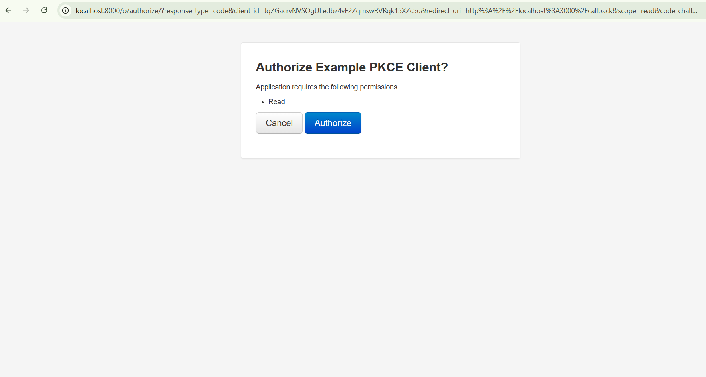

# OAuth2 Project (Django Authorization Server + React PKCE Client)

This repository demonstrates an OAuth2 Authorization Server implemented with **Django OAuth Toolkit** and a **React PKCE client**. It also provides custom endpoints for trusted integrators, OTP-based login, and an optional Docker setup.

---

## Features
- **OAuth2 Authorization Server** (Django OAuth Toolkit)
- **Authorization Code with PKCE** + Refresh Token flow
- **Token rotation** + configurable expiry
- **Custom User model** with role support
- APIs:
  - Token issuance
  - Token introspection
  - Validate token
  - User info
  - Logout (revoke tokens)
  - Roles API
- **OTP-based token issuance** (for passwordless login scenarios)
- **React PKCE client** for login, callback, token exchange, and profile
- **Docker + Docker Compose** setup for Postgres + web

---

## Prerequisites
- Python 3.10+
- Node.js + npm (for React client)
- PostgreSQL (optional; SQLite works for local development)

---

## Local Setup (without Docker)

### 1. Create & activate virtual environment
```bash
python -m venv .venv
# Windows
.\.venv\Scriptsctivate
# macOS/Linux
source .venv/bin/activate
```

### 2. Install dependencies
```bash
pip install -r requirements.txt
```

### 3. Run migrations
```bash
python manage.py migrate
```

### 4. Create superuser & seed demo users
```bash
python manage.py createsuperuser
python manage.py seed_demo_users
```

### 5. Create OAuth client (PKCE public client)
```bash
python manage.py create_oauth_app
```
Copy the printed `CLIENT_ID` into `react-client/src/config.js`.

### 6. Start Django server
```bash
python manage.py runserver
```

### 7. Start React client
```bash
cd react-client
npm install
npm start
```

Open [http://localhost:3000](http://localhost:3000) → Login → Authorize → Fetch Profile.

---

## Environment Variables (`.env`)

Example `.env` configuration:

```env
# OAuth Client (generated via create_oauth_app)
OAUTH_CLIENT_ID=

# React App URLs
OAUTH_REDIRECT_URI=http://localhost:3000/callback
OAUTH_AUTH_URL=http://localhost:8000/o/authorize/
OAUTH_TOKEN_URL=http://localhost:8000/o/token/
API_USERINFO_URL=http://localhost:8000/api/userinfo/

# Security
SERVICE_API_KEY=
SECRET_KEY=
DEBUG=True
ALLOWED_HOSTS=localhost,127.0.0.1

# Database (SQLite default; Postgres example)
DB_NAME=oauth_db
DB_USER=
DB_PASSWORD=
DB_HOST=localhost
DB_PORT=5432

# OAuth2 settings
ACCESS_TOKEN_EXPIRE_SECONDS=3600
REFRESH_TOKEN_EXPIRE_SECONDS=1209600
ROTATE_REFRESH_TOKEN=True

# Superuser auto-create (optional)
DJANGO_SUPERUSER_USERNAME=admin
DJANGO_SUPERUSER_EMAIL=admin@example.com
DJANGO_SUPERUSER_PASSWORD=admin123

# CORS (for React dev)
CORS_ALLOWED_ORIGINS=http://localhost:3000
```

---

## Token Endpoints
change SERVICE_API_KEY in settings.py file
### 1. Username/Password Login
```bash
curl --location 'http://127.0.0.1:8000/api/token/password/' \
--header 'X-Service-Key: <SERVICE_KEY>' \
--form 'username=<USERNAME>' \
--form 'password=<PASSWORD>'
```

### 2. OTP-Based Login
Step 1: Request OTP
```bash
curl --location 'http://127.0.0.1:8000/api/request-otp/' \
--form 'username=<USERNAME>'
```

Step 2: Exchange OTP for Token
```bash
curl --location 'http://127.0.0.1:8000/api/token/otp/' \
--header 'X-Service-Key: <SERVICE_KEY>' \
--form 'username=<USERNAME>' \
--form 'otp=<OTP>'
```

These endpoints are protected via `X-Service-Key` and are intended for **trusted integrators**.

---
## Screenshots


---

## Manual Token Testing (OAuth2 Standard)

- **Exchange code for token**:
```bash
curl -X POST http://localhost:8000/o/token/ \
  -d "grant_type=authorization_code&code=<CODE>&redirect_uri=http://localhost:3000/callback&client_id=<CLIENT_ID>&client_secret=<CLIENT_SECRET>"
```

- **Refresh token**:
```bash
curl -X POST http://localhost:8000/o/token/ \
  -d "grant_type=refresh_token&refresh_token=<REFRESH_TOKEN>&client_id=<CLIENT_ID>&client_secret=<CLIENT_SECRET>"
```

- **Introspect token**:
```bash
curl -u "<CLIENT_ID>:<CLIENT_SECRET>" -X POST http://localhost:8000/o/introspect/ -d "token=<ACCESS_TOKEN>"
```

- **Validate token**:
```bash
curl -X POST http://localhost:8000/api/validate-token/ \
  -H "Content-Type: application/json" \
  -d '{"token":"<ACCESS_TOKEN>"}'
```

- **Logout**:
```bash
curl -X POST http://localhost:8000/api/logout/ -H "Authorization: Bearer <ACCESS_TOKEN>"
```

- **Roles (admin only)**:
```bash
curl -X GET http://localhost:8000/api/roles/ -H "Authorization: Bearer <ADMIN_ACCESS_TOKEN>"
```

---

## Docker Setup
1. Copy `.env.example` → `.env` and adjust values.
2. Start services:
```bash
docker-compose up --build -d
```
3. Run migrations & create OAuth app:
```bash
docker-compose exec web python manage.py migrate
docker-compose exec web python manage.py createsuperuser
docker-compose exec web python manage.py seed_demo_users
docker-compose exec web python manage.py create_oauth_app
```

---

## Security Checklist
- Set `DEBUG=False` in production
- Use a strong `SECRET_KEY`
- Always enable HTTPS
- Set:
  - `SESSION_COOKIE_SECURE=True`
  - `CSRF_COOKIE_SECURE=True`
  - `SESSION_COOKIE_HTTPONLY=True`
- Rotate client secrets and API keys periodically
- Rate-limit token endpoints
- Use **PKCE** for SPA/mobile clients
- Store tokens securely (prefer httpOnly secure cookies)

---

## Screenshots





